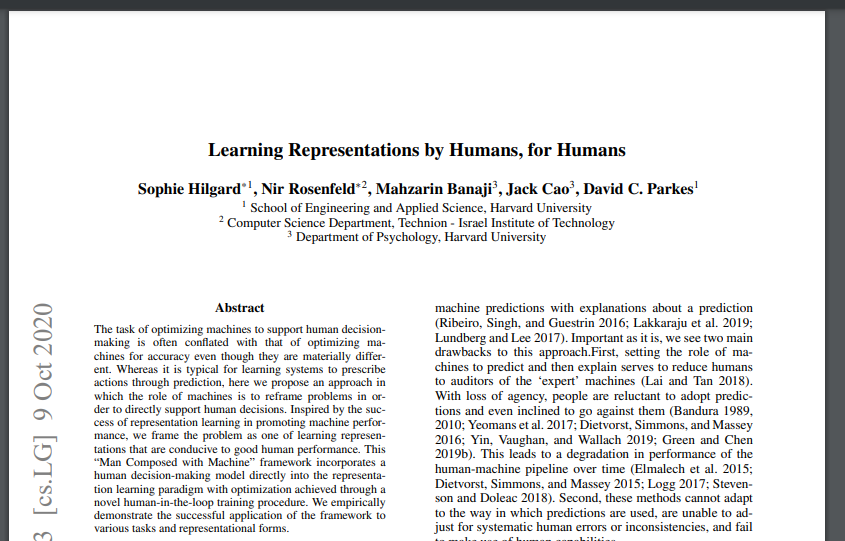
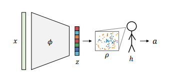
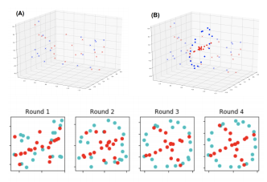
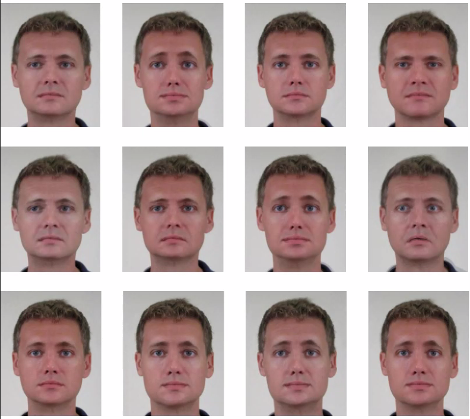

Week 11 - Learning Representations by Humans, for Humans
===
By Andrew Nolan

On Tuesday April 13th, Sophie Hilgard, a computer science PhD researcher at Harvard, gave a talk to my CS 525 - Predicting Human Decisions class. Although this paper is primarily an AI/psychology paper, it utilizes several visualization techniques as the key novelty of the research. I thought it would be useful to reflect on and share with the class here.

Machine learning is really cool. It has a lot of predictive power, its fast, it can handle lots of data, and it can reveal hidden patterns. That said, when humans are involved, it loses some power. Humans have many biases including overreliance on tools, under reliance, negative feedback loops, expert biases, the list goes on. Often times we ignore the "highly accurate" recommendations of AI. Even in a non-serious situation, say Netflix film recommendations, we will happily overrule the recommendations of a computer. Even in more serious situations, such as in the medical field, doctors will often ignore the feedback of AI if they do not understand its reasoning.

One type of machine learning is *Representation Learning* also known as Feature Learning [2]. Representation Learning seeks to aid researchers in feature engineering, by removing or combining features of multi-featured data. Examples include common methods such as PCA or clustering. These are useful things in most data focused fields, including Vis. Decisions are subjective and also narrative. The researchers of this paper propose that instead of providing users with a simple scalar recommendation or a list of features that the user will simply ignore, we can train an algorithm to produce a visualization that will guide users to a more accurate decision. Instead of training a neural network to have a computer make a decision, we train a network in which in the end a human makes a decision. They call this approach *mind composed with machine* (MoM). The process can be seen in the figure below.

The first experiment conducted for this paper was to evolve a decision compatible scatterplot by taking data classified as either *X* or *O*. We give the user a scatterplot and over several iterations improve the scatterplot to achieve high human accuracy. The evolution of these scatterplots can be seen below. After about 4 iterations humans had a nearly perfect classification rate. Of course, the computer was able to accurately classify from the beginning, but our goal here is to have humans make decisions. By adjusting the point clouds after each response to account for bias we can generate scatterplots that get humans to make the decisions we would want. You can see the evolution of the scatterplots and how the 2d points get shifted in 3d space in the figure below.

During her talk, Sophie said this approach can be used with many types of outputs: scatterplots, highlighting key features, pros and cons lists, highlighting key reference points, or "algorithmic avatars". They wanted to make their paper extra novel, so they experimented with this last approach. Algorithmic avatars are faces used to provide emotional representations that numeric values may not give to humans. The experiment in this paper found that humans making loan approval predictions were more accurate taking advice from an avatar than a numeric value. For example a look of distress or concern made users less likely to approve a loan that a simple 30% chance of paying it back. The results, like the scatterplots before, showed that MoM can be used to generate visualizations that aid humans in making decisions. Below is an example of some of the avatars that were shown to users during this experiment.

I find explainable AI to be a really cool subject I would like to learn more about. While this isn't an example of explainable AI, it is an example of how humans can be put into the machine learning pipeline. It also shows a cool application of visualizations to not just depict data but use data to encourage users to make specific decisions.

Sources
---
1. Learning Representations by Humans, for Humans - https://arxiv.org/abs/1905.12686
2. Representation Learning - https://en.wikipedia.org/wiki/Feature_learning