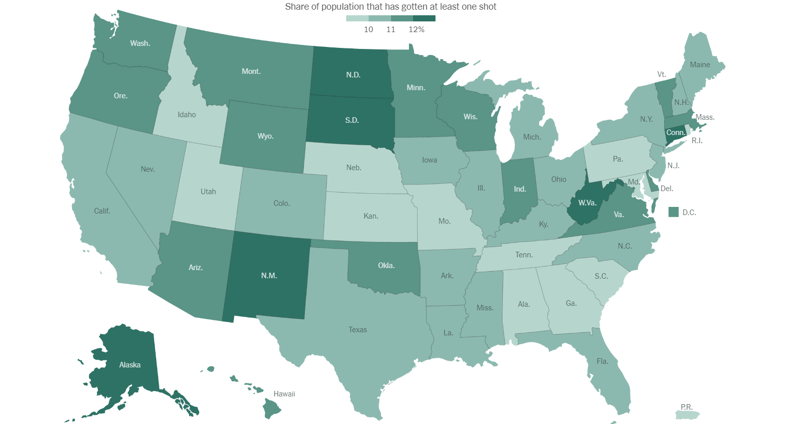
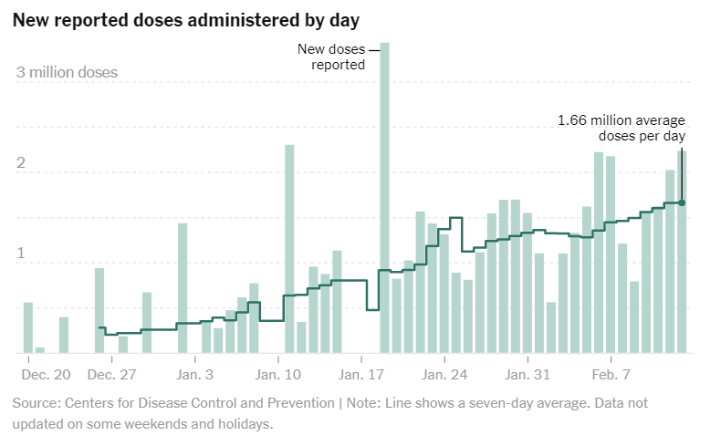
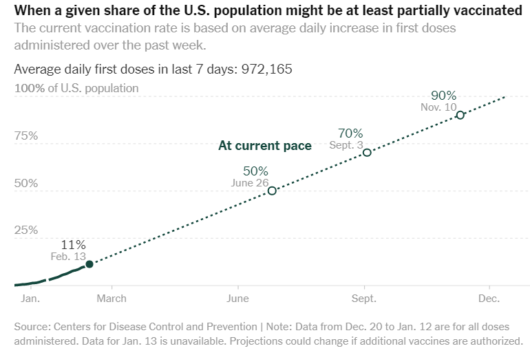

Week 2 - COVID Rollout by State in the US
===
By Andrew Nolan

#### Dicusssion
As we've mentioned in class, the New York Times has become very good at using data visualizations in their articles for readers to *consume* to learn and enjoy. They currently maintain a page that tracks vaccine rollouts by state, it can be viewed here: https://www.nytimes.com/interactive/2020/us/covid-19-vaccine-doses.html. The center piece of this page is a map of the United States in which each state is color coded according to the percentage of the population who has recieved at least one shot. The data visualization includes a mouseover feature to allow users to view the exact percentage of citizens who have recieved one or two shots in the state.

I saw this visualization while I unsuccessfully sought optimistic information about the vaccine rollout. After last Thursday's in class exercise, when I see visualizations I am thinking a lot more about the what, why, and how. So when I stumbled upon this visualization, besides the COVID info, those questions were my early thoughts. The what of the vis includes things such as: a spatial geometry of the US, sequential ordinal data (increasing percentages), and although it's coming in very slowly, I suppose it's dynamic data since it's updated over time. The why includes a common action of the New York Times - Analyzing to consume and enjoy. It also allows for searching with lookup. The targets are feature distributions showing the population that is vaccinated. The how includes an encoding that arranges the data by using a map and maps it by using color luminance. Overall I think it's an effective visualization. COVID vaccinations per state is not a super complicated data, but this visualization displays it in a very effective and easy to use and analyze way. Most other websites presenting similar data are doing it in table form, not as effectively.

Finally, as a bonus this page has even more visualizations! The two extra visualizations I want to share are the following:

These two visualizations are not as fancy as the map. One is a bar chart with a trendline and the other is a line graph with a prediction line extending it. While, simple, they again effectively convey the content they want to present. And when used together they provide interesting analysis. The trendline of doses administered by day is following an increasing pattern. Implying that the number of people that can be vaccinated each day will continue to increase. The second graph bases it's percentage of the population vaccinated on a constant vaccination rate. However, assuming the vaccination rate is increasing each day, this prediction curve shouldn't be linear, it should be exponential. This means we may reach 90% vaccinated well before November 10th. At least I can hope that. I came into this data visualization looking for optimistic information, so maybe I just biased myself into that interpretation...

Sources
---
1. https://www.nytimes.com/interactive/2020/us/covid-19-vaccine-doses.html
2. The Visualization Analysis and Design textbook
